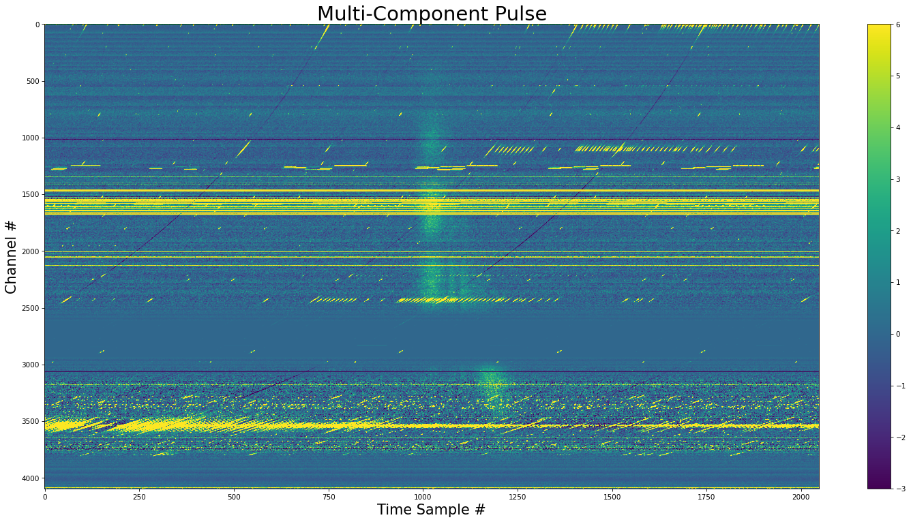

# WILL - Weighted Injector of Luminous Lighthouses

`will` is a library to create, inject, and detect pulses from Fast Radio Bursts and pulsars.

<p align="center">
  
</p>

<p align="center">
  
</p>

# Installation
To install directly into your current Python environment
```bash
pip install git+https://github.com/josephwkania/will.git
```

If you want a local version
```bash
git clone https://github.com/josephwkania/will.git
cd will
pip install .
```

# Examples
There are [example notebooks](https://github.com/josephwkania/will/tree/master/examples) that show how to create, inject, and detect pulses.
